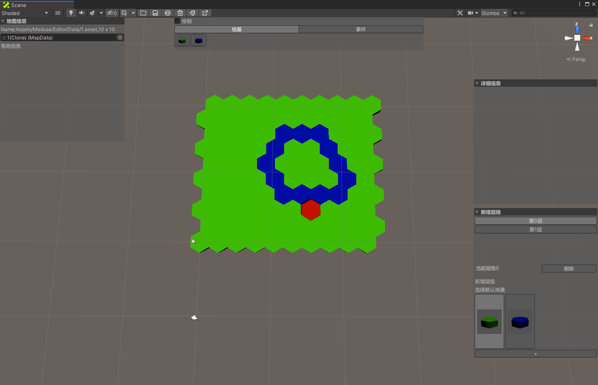
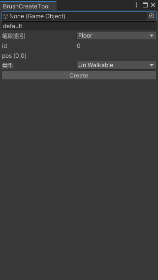

# 六边形编辑器
## 预览



## 操作说明
1. 工具栏说明
*   打开文件  
*   保存文件  
*   创建地图  
*   删除当前编辑  
*   创建画刷  
*   导出xml  
2. 画刷说明  
点击创建画刷按钮得到如下图所示界面  
  
创建成功后，画刷会在编辑器中显示  
点击绘制，选中画刷同时选中场景中的物体就可以开始画了  

## 目录结构
```
project
│   README.md 说明文档
│   doc 文档资源    
│
└───hex
│   │   ...
│   │   
│   │   
│   └───Assets
│       │      ...
│       │  
│       └───  MapEditor 编辑器目录
|              │    BrushPrefabs 各种画刷预制体
|              │    Editor 编辑器本体
|              │    Runtime 运行时代码
│               
└———...
```

## 更新日志
* 2020年9月3日15:38:28
* 新增寻路功能
* 重命名 美杜莎 编辑器
* 新增快捷键 Alt + M
---
* 2020年8月27日15:05:01
* 新增撤回操作 
* 解决建筑替换建筑数据不刷新的问题
---
* 2020年8月26日21:00:01
* 基础版本提交 
